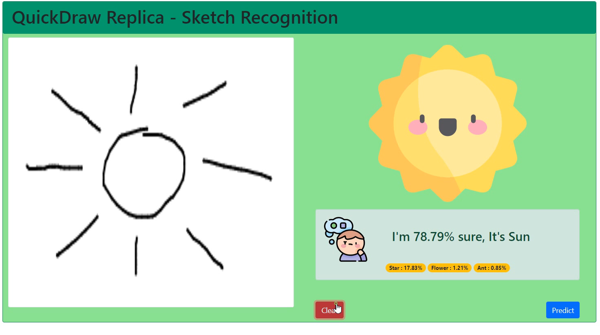

# sketch-recognition-ml-django

The Quick Draw Dataset is a collection of 50 million drawings across [345 categories](categories.txt), contributed by players of the game [Quick, Draw!](https://quickdraw.withgoogle.com). The drawings were captured as timestamped vectors, tagged with metadata including what the player was asked to draw and in which country the player was located. You can browse the recognized drawings on [quickdraw.withgoogle.com/data](https://quickdraw.withgoogle.com/data). 

### Dataset: [quickdraw dataset](https://github.com/googlecreativelab/quickdraw-dataset)
**Note:** Trained for only 10 labels
`
          class_names = {
            0: 'ant',
            1: 'bird',
            2: 'crown',
            3: 'envelope',
            4: 'face',
            5: 'fish',
            6: 'flower',
            7: 'house',
            8: 'star',
            9: 'sun'
        }
`
## Code Requirements 🦄
You can install Conda, django and django REST for python which resolves all the dependencies for machine learning.
or,

`pip install -r requirements.txt`

## Implementation 

1) Convolutional Neural Network
2) Django and Django REST framework poered backend

## Setup 🖥️

1) Clone the repo
2) Install the pre requities libraries
3) On directory containing `manage.py` run `>>> python mnage.py runserver`

